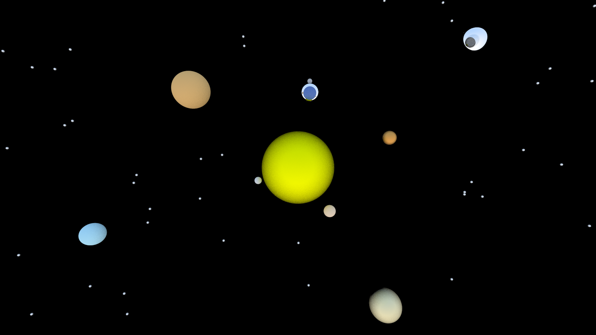
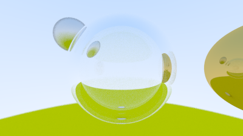

# RayTracer

A simple raytracer built from scratch in C++ using the guidance from "Ray Tracing in One Weekend"

It features three materials: lambertan, metal, and glass.
Each of these can be used to change the appearance of a sphere.

The camera features variable fov, depth of field effect and multisample anti-aliasing.

# Try it out

To run the ray tracer run

`
main.exe <output-file.cpp>
`

Then choose between rendering a ***default scene*** or ***creating your own***.

 

## Default Scene
There are two default scenes that you can choose to render. 
Depending on how much sampling you choose and the size of the image. Rendering can take quite a while.

### Space

### Marbles

 

## Make Your Own

To create your own scene you will need to input each sphere you want to render, and then the camera and render properties for your image.

For each sphere you want to create input the line:

`x y z radius material material-properties`

After making generating all the spheres you can choose camera parameters like ***location***, ***direction***, ***fov***, ***depth of field***, ***multi-sampling*** and the ***width*** of the output image.

It will then render your image to the ***output file*** that you first specified.

 

## Viewing the image

Since the image is stored in a ***ppm***, you will need to find some way to view the image.
I used this vscode extension 

